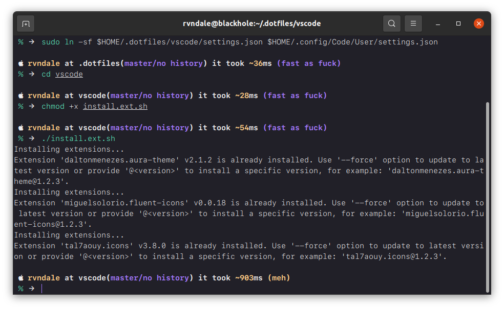
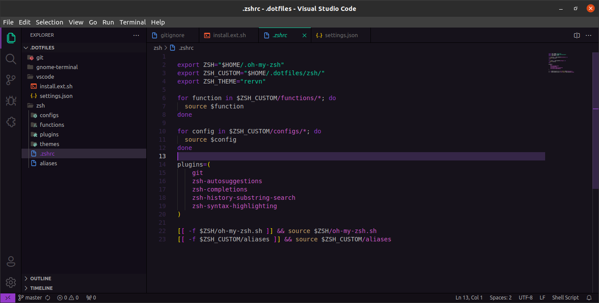
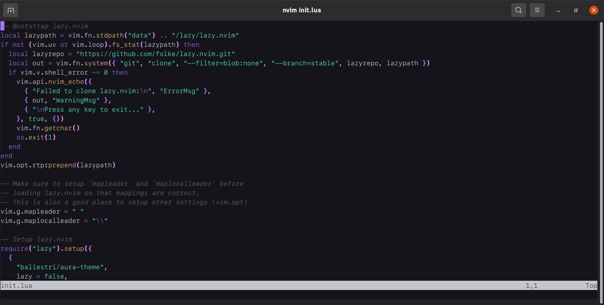

# Ravendale's dotfiles




## Installation

**Warning**: Many files are symlinks to one another:
- `.zshrc` is a symlink to `.dotfiles/zsh/.zshrc`
- `settings.json`is a symlink to `.dotfiles/vscode/settings.json`

You can clone repo wherever you want doe, but you need to remember 'bout symlinks, otherwise shit won't work and look like mine.

I didn't create any bootstrap script or shit like that.

```bash
git clone git@github.com:ravndale/.dotfiles.git
sudo ln -sf <your path>/.dotfiles/zsh/.zshrc $HOME/.zshrc
sudi ln -sf <your path>./dotfiles/vscode/settings.json $HOME/.config/Code/User/settings.json
```

## GNOME terminal
You need to install theme located in `.dotfiles/gnome-terminal` using `dconf`, otherwise terminal won't look like mine.

## Fonts
I am using patched Apple font which is: [SF Mono Ligaturized](https://github.com/shaunsingh/SFMono-Nerd-Font-Ligaturized) by shaunsingh.

# Firefox
[Aura Theme](https://github.com/daltonmenezes/aura-theme/tree/main/packages/firefox) for Firefox is available in [Firefox Addon Store](https://addons.mozilla.org/en-US/firefox/addon/aura-theme/).

# Neovim
[Aura Theme](https://github.com/daltonmenezes/aura-theme/tree/main/packages/neovim) for Neovim.
I am using Ubuntu 20.x, so I needed to compile latest version of neovim from sources for it to work.




## Thanks to…
- @[mathiasbynens](https://github.com/mathiasbynens) and his [dotfiles](https://github.com/mathiasbynens/dotfiles) repository..
- @[thoughtbot](https://github.com/thoughtbot/) and theirs [dotfiles](https://github.com/thoughtbot/dotfiles) repository..
- @[joshukraine](https://github.com/joshukraine/) and his [dotfiles](https://github.com/joshukraine/dotfiles) repository..
- @[Sindre Sorhus](https://github.com/sindresorhus) and his [Pure](https://github.com/sindresorhus/pure) theme for zsh..
- @[Julien Nicoulaud](https://github.com/nicoulaj) and his [Refined](https://github.com/ohmyzsh/ohmyzsh/blob/master/themes/refined.zsh-theme) theme for zsh..
- @[daltonmenezes](https://github.com/daltonmenezes/) and his [Aura](https://github.com/daltonmenezes/aura-theme) theme..